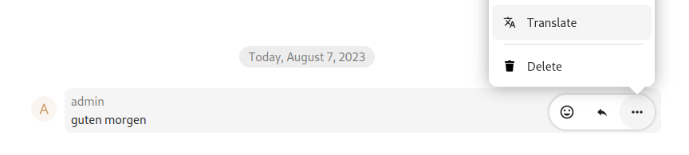

# Deepl.com integration for Nextcloud

This app integrates with the translation API of Nextcloud server to offer translation services through deepl. Currently this is available in text.

## Ethical AI Rating
### Rating: 🔴

Negative:
* the software for training and inferencing of this model is proprietary, limiting running it locally or training by yourself
* the trained model is not freely available, so the model can not be ran on-premises
* the training data is not freely available, limiting the ability of external parties to check and correct for bias or optimise the model’s performance and CO2 usage.

Learn more about the Nextcloud Ethical AI Rating [in our blog](https://nextcloud.com/blog/nextcloud-ethical-ai-rating/).

## Configuring

In the "Connected Accounts" section of the admin settings, the admin has the option to set the API key of the DeepL translation API.

Alternatively, you can run this command to set it:
```
occ config:app:set integration_deepl apikey --value="apikey"
```

## 🖼️ Screenshots




## 🛠️ State of maintenance

While there are many things that could be done to further improve this app, the app is currently maintained with **limited effort**. This means:

- The main functionality works for the majority of the use cases
- We will ensure that the app will continue to work like this for future releases and we will fix bugs that we classify as 'critical'
- We will not invest further development resources ourselves in advancing the app with new features
- We do review and enthusiastically welcome community PR's

We would be more than excited if you would like to collaborate with us. We will merge pull requests for new features and fixes. We also would love to welcome co-maintainers.

If there is a strong business case for any development of this app, we will consider your wishes for our roadmap. Please [contact your account manager](https://nextcloud.com/enterprise/) to talk about the possibilities.
